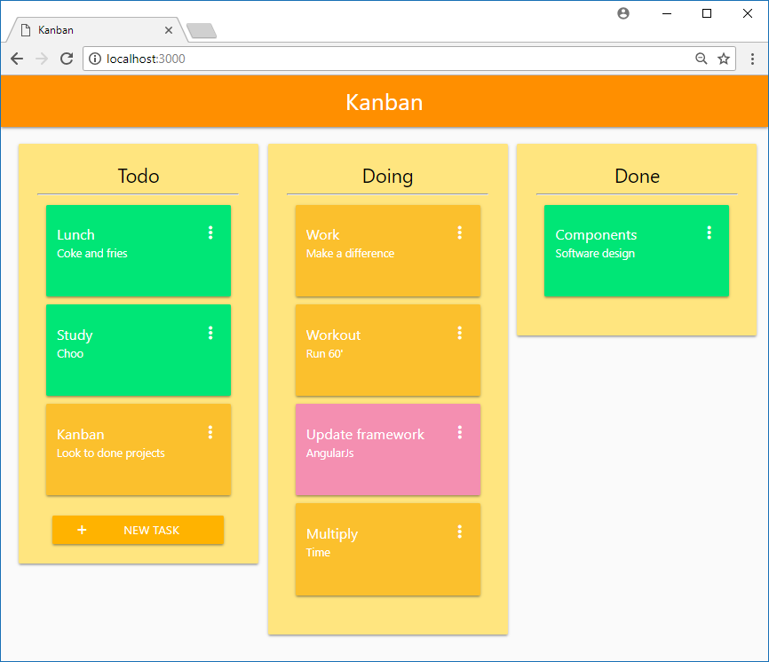

# Kanban Component
Just a simple kanban component to choo.js



## How to use
Add in your routes:
```js
 * app.route('/kanban', kanban);
```

Add this styles:
```
import 'materialize-css/dist/css/materialize.min.css';
import 'sweetalert2/dist/sweetalert2.min.css';
import './style/style.css';
```

Use this events files:
```js
/* Events */
import persistence from '../node_modules/choo-ban/src/events/persistence';
import boards from '../node_modules/choo-ban/src/events/boards';
import boardItems from '../node_modules/choo-ban/src/events/boardItems';

app.use(persistence);
app.use(boards);
app.use(boardItems);
```

Allow this route:
```
import kanban from '../node_modules/choo-ban/src/containers/kanban';
app.route('/kanban', kanban);
```

## Source
This project was forked from [Luiz Baldi](https://github.com/luizbaldi/choo-ban)


## Running locally
After downloading (or cloning) this repo, just run:
```
yarn
yarn start
```

## Contributors
- [Luiz Baldi](https://github.com/luizbaldi)
- [Pedro Fontes](https://github.com/phfontess)
- [Juan Carvalho](https://github.com/juanrequeijo)

